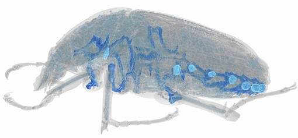

---
# Feel free to add content and custom Front Matter to this file.
# To modify the layout, see https://jekyllrb.com/docs/themes/#overriding-theme-defaults

layout: home
---

**Isometric Spiracular Scaling in Scarab Beetles: Implications for Diffusive and Advective Oxygen Transport**

  

A reconstruction of one of the scarab beetles from our dataset. The blue tubes within the beetle show the large, main tracheal trunk connected to the lighter blue spiracles. Scarab beetles have eight spiracles, six in the abdomen and two in the thorax. Spiracles are the openings of the tracheal system through which air enters the animal to supply oxygen to their muscles and other tissue. 

For information on the beetles included in our scaling study, and details on the measurements we took of the spiracles, take a look [here](./studydesign/study_design.html).

For details and code on the regression analyses that we performed, take a look [here](./regressions/bayesian_nonparametric_linear_regression.html).

For the calculations and code to generate the expected partial pressure gradients of oxygen needed to supply beetle metabolic demand, take a look [here](./oxygen_gradiant/diffusion_advection_regressions.html).

For supplementary regressions investigating whether phylogeny influenced the observed scaling patters, look [here](./bayesian_phylogenetic/bayesian_phylogenetic_regression.html) for a Bayesian approach in python, and [here](./pgls_R/just_pgls_R.html) for a frequentist approach in R. 

Code needed to take raw pixel measurements of the spiracles and parse them, convert to a tidy format, and calculate values with real world units, look [here](./parse_raw_data/parse_raw_data.html).
