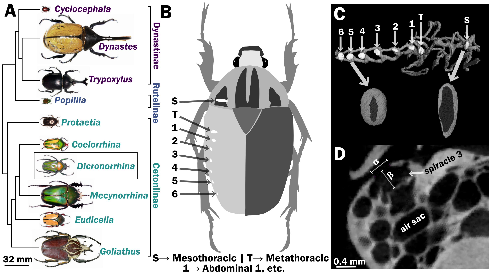

Figure 1. Scarab beetles include large bodied individuals and have eight spiracles. (a) Phylogenetic tree for the scarab beetles used in this study showing size distribution among clades (branch lengths are meaningless). (b) Location of the eight spiracles in the scarab body. (c) 3D reconstruction of the tracheal trunks in the thorax, legs and abdomen of *Dicronorrhina derbyana*; spiracles are shown in white. The larger images of spiracles show the size of the opening (dark in color) compared to the mushroom-shaped (white) atrium behind and the differences in spiracle shape. (d) Transverse x-ray slice through the third abdominal spiracle with diameter, α, and depth, β, measures illustrated.